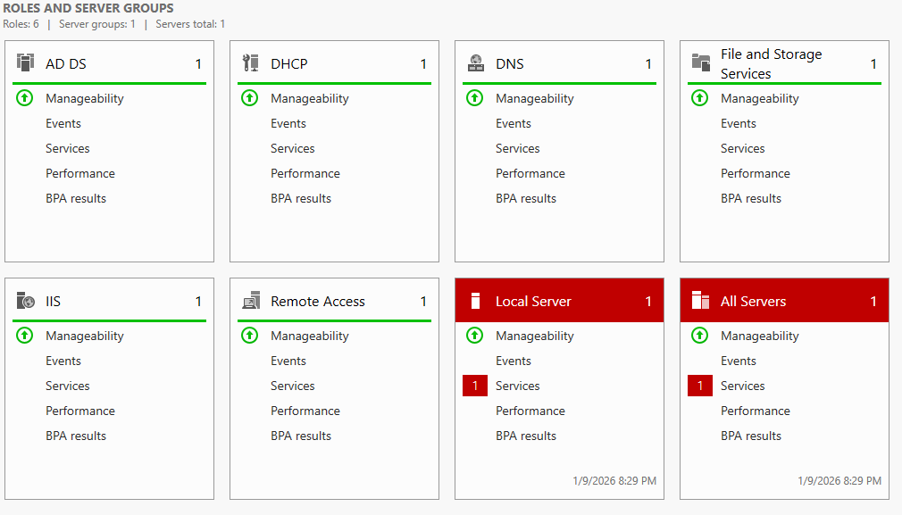
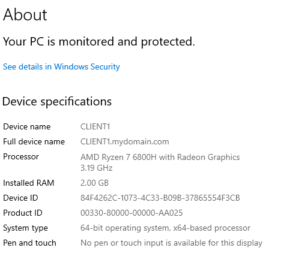
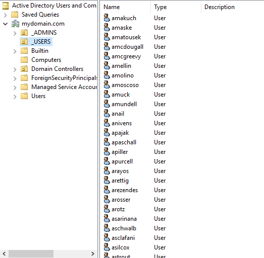

# Active Directory Baseline Build

## Purpose

The purpose of this phase was to build a functional Active Directory environment exactly as described in the source walkthrough, without introducing hardening, auditing, or security controls.

---

## Lab Scope and Constraints

- Single Domain Controller
- Single Windows client
- Default Active Directory configuration
- Bulk user creation via PowerShell

---

## Environment Overview

| Component | Description |
|---------|-------------|
| Domain Controller | Windows Server (AD DS, DNS) |
| Client | Domain-joined Windows workstation |
| Identity | Domain users created via script |

---

## Build Summary

The baseline environment was built successfully with no deviations from the walkthrough.

---

## Security Observations (Baseline)

At this stage:
- Authentication worked with minimal friction
- Authorization was largely implicit
- No additional logging or auditing was enabled

These observations were intentionally preserved for later comparison.

---

## Evidence

The following screenshots confirm the baseline state of the environment.

---

## Why This Baseline Matters

This untouched baseline establishes a control state for understanding how security-relevant behavior changes when configuration or permissions are modified in later phases.
